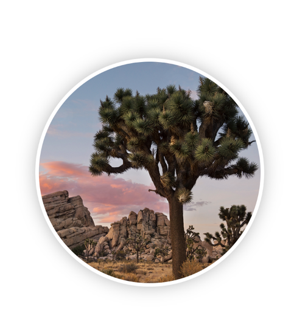

# SwiftUI

## 프리뷰어

```swift
//여러 디바이스를 프리뷰
struct ContentView_Previews: PreviewProvider {
    static var previews: some View {
        ForEach(["iPhone SE", "iPhone XS Max"], id: \.self) { deviceName in
            ContentView()
                .previewDevice(PreviewDevice(rawValue: deviceName))
        }
    }
}

//뷰를 특정 크기만큼 프리뷰
struct LandmarkRow_Previews: PreviewProvider {
    static var previews: some View {
        LandmarkRow(landmark: landmarkData[1])
            .previewLayout(.fixed(width: 300, height: 70))
    }
}
```


### UIView 프리뷰

```swift
struct UIViewPreview<View: UIView>: UIViewRepresentable {
    let view: View
    
    init(_ builder: @escaping () -> View) {
        view = builder()
    }
    
    // MARK: - UIViewRepresentable
    func makeUIView(context: Context) -> UIView {
        return view
    }
    
    func updateUIView(_ view: UIView, context: Context) {
        view.setContentHuggingPriority(.defaultHigh, for: .horizontal)
        view.setContentHuggingPriority(.defaultHigh, for: .vertical)
    }
}

//두개의 뷰를 그룹 지어서 보기
struct BorderedButton_Preview: PreviewProvider {
    static var previews: some View {
        Group {
            UIViewPreview {
                let button = BorderedButton(frame: .zero)
                button.setTitle("Follow", for: .normal)
                button.tintColor = .systemOrange
                button.setTitleColor(.systemOrange, for: .normal)
                return button
            }
            
            UIViewPreview {
                let button = BorderedButton(frame: .zero)
                button.setTitle("Follow", for: .normal)
                button.tintColor = .systemOrange
                button.setTitleColor(.systemOrange, for: .normal)
                return button
            }
        }.previewLayout(.sizeThatFits)
            .padding(10)
    }
}

//하나의 뷰를 사이즈별로 한번에 보기
ForEach(ContentSizeCategory.allCases, id: \.self) { sizeCategory in
  UIViewPreview {
      let button = BorderedButton(frame: .zero)
      button.setTitle("Subscribe", for: .normal)
      button.setImage(UIImage(systemName: "plus"), for: .normal)
      button.setTitleColor(.systemOrange, for: .normal)
      button.tintColor = .systemOrange
      return button
  }.environment(\.sizeCategory, sizeCategory)
   .previewDisplayName("\(sizeCategory)")
}.previewLayout(.sizeThatFits)
 .padding(10)

//언어 별로 보기
let supportedLocales: [Locale] = [
  "en-US", // English (United States)
  "ar-QA", // Arabic (Qatar)
  "he-IL", // Hebrew (Israel)
  "ur-IN"  // Urdu (India)
].map(Locale.init(identifier:))

func localizedString(_ key: String, for locale: Locale) -> String? { … }

return ForEach(supportedLocales, id: \.identifier) { locale in
  UIViewPreview {
    let button = BorderedButton(frame: .zero)
    button.setTitle(localizedString("Subscribe", for: locale), for: .normal)
    button.setImage(UIImage(systemName: "plus"), for: .normal)
    button.setTitleColor(.systemOrange, for: .normal)
    button.tintColor = .systemOrange
    return button
  }.environment(\.locale, locale)
   .previewDisplayName(Locale.current.localizedString(forIdentifier: locale.identifier))
}.previewLayout(.sizeThatFits)
 .padding(10)
```


## Property Wrappers

### @State

```swift
//이런식으로 변수 선언하면
@State private var showDetail = false
//다음과 같이 toggle() 메서드를 사용할 수 있음
Button(action: {
                    self.showDetail.toggle()
                })
```

### @Binding

```swift
//뷰에 값을 전달하기 위해 사용함
//예제
struct FilterView: View {
    @Binding var showFavorited: Bool

    var body: some View {
        Toggle(isOn: $showFavorited) {
            Text("Change filter")
        }
    }
}

struct ProductsView: View {
    let products: [Product]

    @State private var showFavorited: Bool = false

    var body: some View {
        List {
            FilterView(showFavorited: $showFavorited)

            ForEach(products) { product in
                if !self.showFavorited || product.isFavorited {
                    Text(product.title)
                }
            }
        }
    }
}
```

### @Published

```swift
//양반향 바인딩
//예제
final class PodcastPlayer: ObservableObject {
    @Published private(set) var isPlaying: Bool = false

    func play() {
        isPlaying = true
    }

    func pause() {
        isPlaying = false
    }
}

struct EpisodesView: View {
    @ObservedObject var player: PodcastPlayer
    let episodes: [Episode]

    var body: some View {
        List {
            Button(
                action: {
                    if self.player.isPlaying {
                        self.player.pause()
                    } else {
                        self.player.play()
                    }
            }, label: {
                    Text(player.isPlaying ? "Pause": "Play")
                }
            )
            ForEach(episodes) { episode in
                Text(episode.title)
            }
        }
    }
}
```

#### @EnvironmentObject

```swift
//Pubilshed와 기본적으로 같지만 뷰를 초기화할때 외부에서 값을 주입할 수 있고 참조로 대입되기 때문에 환경변수처럼 사용할 수 있다.
@EnvironmentObject var userData: UserData

//예제
class SceneDelegate: UIResponder, UIWindowSceneDelegate {

    var window: UIWindow?

    func scene(_ scene: UIScene, willConnectTo session: UISceneSession, options connectionOptions: UIScene.ConnectionOptions) {
        let window = UIWindow(frame: UIScreen.main.bounds)
        let episodes = [
            Episode(id: 1, title: "First episode"),
            Episode(id: 2, title: "Second episode")
        ]

        let player = PodcastPlayer()
        window.rootViewController = UIHostingController(
            rootView: EpisodesView(episodes: episodes)
                .environmentObject(player)
        )
        self.window = window
        window.makeKeyAndVisible()
    }
}

struct EpisodesView: View {
    @EnvironmentObject var player: PodcastPlayer
    let episodes: [Episode]

    var body: some View {
        List {
            Button(
                action: {
                    if self.player.isPlaying {
                        self.player.pause()
                    } else {
                        self.player.play()
                    }
            }, label: {
                    Text(player.isPlaying ? "Pause": "Play")
                }
            )
            ForEach(episodes) { episode in
                Text(episode.title)
            }
        }
    }
}
```

### @Enviroment

```swift
//시스템의 변수로 양방향 바인딩할 수 있다.
//예제
struct CalendarView: View {
    @Environment(\.calendar) var calendar: Calendar
    @Environment(\.locale) var locale: Locale
    @Environment(\.colorScheme) var colorScheme: ColorScheme

    var body: some View {
        return Text(locale.identifier)
    }
}

//커스텀 Enviroment Key
struct ImageFetcherKey: EnvironmentKey {
    static let defaultValue: ImageFetcher = ImageFetcher()
}

extension EnvironmentValues {
    var imageFetcher: ImageFetcher {
        get {
            return self[ImageFetcherKey.self]
        }
        set {
            self[ImageFetcherKey.self] = newValue
        }
    }
}
```


## Position

```swift
VStack(alignment: .leading) {//정렬 설정
            Text("Turtle Rock")
                .font(.title)
            Text("Joshua Tree National Park")
                .font(.subheadline)
        }
.offset(y: -130)	//위로 이동
.padding(.bottom, -130)	//아래 패딩 설정

Spacer()	//동적 공간 생성
```


## View

```swift

struct CircleImage: View {
    var body: some View {
        Image("turtlerock")
            .clipShape(Circle())	//라운딩
            .overlay(
                Circle().stroke(Color.white, lineWidth: 4))	//테두리
            .shadow(radius: 10)	//그림자
    }
}
```




## NavigationView

```swift
struct LandmarkList: View {
    var body: some View {
        NavigationView {
          Form {	//하나의 셀 같은느낌
                        Section {	//하나의 폼에는 여러개의 섹션이 들어갈 수 있다.
                          List(landmarkData) { landmark in
                NavigationLink(destination: LandmarkDetail()) {	//페이지 이동
                    LandmarkRow(landmark: landmark)
                }
            }
                        }
          }.navigationBarTitle(Text("Landmarks"))	//네비게이션뷰 타이틀
        }
    }
}

//네비게이션 픽커
struct TypePickerView: View {
    var strengths = TreeValueType.getAllCase()
    @State private var selectedStrength = 0
    
    var body: some View {
        NavigationView {
            Form {
                Section {
                    Picker(selection: $selectedStrength, label: Text("Strength")) {
                        ForEach(0 ..< strengths.count) {
                            Text(self.strengths[$0])

                        }
                    }
                }
            }.navigationBarTitle("Select your cheese")
        }
    }
}
```


## Animation

```swift
Button(action: {
              withAnimation(.easeInOut(duration: 4)) {	//UIView.anmation 같은거
                        self.showDetail.toggle()
                    }
                }) {
                    Image(systemName: "chevron.right.circle")
                        .imageScale(.large)
                        .rotationEffect(.degrees(showDetail ? 90 : 0))	//회전 이벤트
                        .scaleEffect(showDetail ? 1.5 : 1)	//스케일 이벤트
                        .padding()
                }

if showDetail {
                HikeDetail(hike: hike)
                    .transition(.slide)	//이동 이벤트
  									//혹은
  									.move(edge: .trailing)	//이동 이벤트
            }

//이동 이벤트 커스텀 익스텐션
extension AnyTransition {
    static var moveAndFade: AnyTransition {
        let insertion = AnyTransition.move(edge: .trailing)
            .combined(with: .opacity)
        let removal = AnyTransition.scale
            .combined(with: .opacity)
        return .asymmetric(insertion: insertion, removal: removal)
    }
}

//애니메이션 변수 선언
var animation: Animation {
    Animation.spring(dampingFraction: 0.5)
        .speed(2)
        .delay(0.03 * Double(index))
}

var body: some View {
    Capsule()
        .fill(Color.gray)
        .frame(height: height * heightRatio, alignment: .bottom)
        .offset(x: 0, y: height * -offsetRatio)
        .animation(animation)	//애니메이션 변수 적용
    )
}
```

