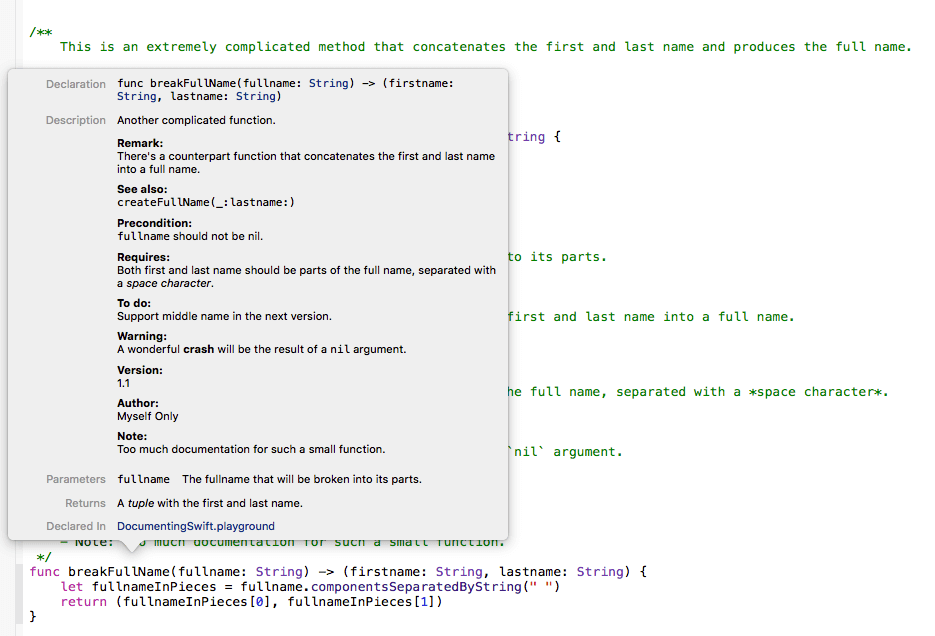

# iOS Documentation


### Snippet

```swift
/**
    Another complicated function.
 
    - Parameter fullname: The fullname that will be broken into its parts.
    - Returns: A *tuple* with the first and last name.
 
    - Remark:
        There's a counterpart function that concatenates the first and last name into a full name.
 
    - SeeAlso:  `createFullName(_:lastname:)`
 
    - Precondition: `fullname` should not be nil.
    - Requires: Both first and last name should be parts of the full name, separated with a *space character*.
 
    - Todo: Support middle name in the next version.
 
    - Warning: A wonderful **crash** will be the result of a `nil` argument.
 
    - Version: 1.1
 
    - Author: Myself Only
 
    - Note: Too much documentation for such a small function.
 */
func breakFullName(fullname: String) -> (firstname: String, lastname: String) {
    let fullnameInPieces = fullname.componentsSeparatedByString(" ")
    return (fullnameInPieces[0], fullnameInPieces[1])
}
```




## Producing Documentation Pages With Jazzy

URL: https://www.appcoda.com/swift-markdown/

